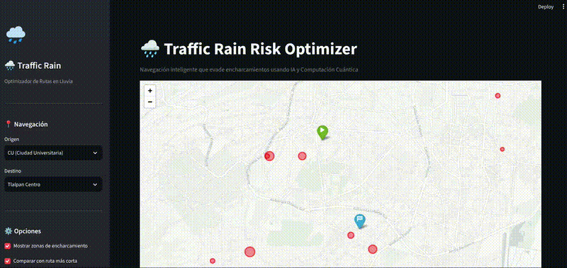

# Traffic-Rain-AI: Optimización Híbrida de Rutas

Traffic-Rain-AI es una solución avanzada de optimización urbana que integra Machine Learning y computación cuántica para mitigar riesgos viales derivados de condiciones climáticas adversas.

## Demo del Sistema

> También disponible en [formato video (webm)](assets/demo/demo.webm).

## Arquitectura del Sistema

La arquitectura sigue un patrón de **almacenamiento desacoplado**, separando el procesamiento de los datos de su persistencia.

### Detalle de Arquitectura

- **Fuente de Verdad:** Amazon S3 actúa como Data Lake, albergando modelos y resultados.
- **Inferencia Eficiente:** Se utiliza un flujo de trabajo por lotes (Batch Inference), eliminando la necesidad de endpoints costosos.
- **Front-end:** Streamlit consume datos directamente de S3 para una visualización dinámica.

## Stack Tecnológico

| Componente | Tecnología |
|------------|-----------|
| Persistencia | AWS S3 (versionado de datasets y resultados) |
| Optimización cuántica | Amazon Braket (algoritmo QAOA) |
| Machine Learning | Scikit-Learn (Random Forest) |
| Interfaz de usuario | Streamlit + Folium |
| Routing | OSMnx + NetworkX (Dijkstra penalizado) |

## Licencia

Este proyecto está protegido bajo la **GNU Affero General Public License v3.0 (AGPL-3.0)**.
